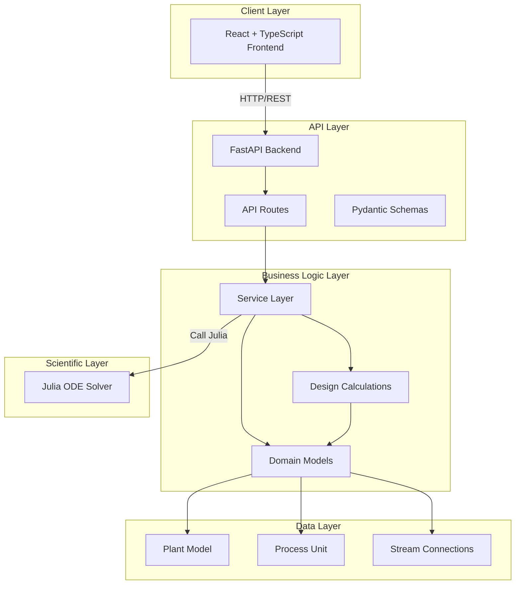

# Design Document: Yaku Digital Twin MVP

## Overview

The Yaku Digital Twin MVP is a Water Treatment Plant (PTAP) simulation platform that provides modeling, design, and simulation capabilities for potable water treatment processes. The system consists of:

- **Backend**: Python/FastAPI server for plant modeling, process calculations, and API endpoints
- **Frontend**: React + TypeScript + Vite client for visualization and user interaction  
- **Scientific Engine**: Julia-based ODE solver for dynamic simulation

This design extends the existing v0.1 MVP with comprehensive implementation and launch capabilities across 8 core requirements.

### Architecture Overview



## Architecture

### Component Layers

The system follows a layered architecture with clear separation of concerns:

```
┌─────────────────────────────────────────────────────────────┐
│                     Presentation Layer                        │
│  ┌─────────────────────────────────────────────────────────┐ │
│  │  React Frontend (App.tsx, components, styles)           │ │
│  │  - Plant visualization                                  │ │
│  │  - Parameter input forms                                │ │
│  │  - Result display                                       │ │
│  └─────────────────────────────────────────────────────────┘ │
└─────────────────────────────────────────────────────────────┘
                        ↓ HTTP/REST
┌─────────────────────────────────────────────────────────────┐
│                      API Layer                                │
│  ┌─────────────────────────────────────────────────────────┐ │
│  │  FastAPI Backend (main.py, routes.py)                   │ │
│  │  - REST endpoints                                       │ │
│  │  - Request validation (Pydantic)                        │ │
│  │  - Error handling                                       │ │
│  └─────────────────────────────────────────────────────────┘ │
└─────────────────────────────────────────────────────────────┘
                        ↓
┌─────────────────────────────────────────────────────────────┐
│                   Business Logic Layer                        │
│  ┌─────────────────────────────────────────────────────────┐ │
│  │  Service Layer (classic_service.py)                     │ │
│  │  - Orchestrates calculations                            │ │
│  │  - Manages plant operations                             │ │
│  └─────────────────────────────────────────────────────────┘ │
│  ┌─────────────────────────────────────────────────────────┐ │
│  │  Design Calculations (design.py)                        │ │
│  │  - Rapid mix calculations                               │ │
│  │  - Flocculation calculations                            │ │
│  │  - Sedimentation calculations                           │ │
│  │  - Filtration calculations                              │ │
│  │  - Disinfection calculations                            │ │
│  └─────────────────────────────────────────────────────────┘ │
└─────────────────────────────────────────────────────────────┘
                        ↓
┌─────────────────────────────────────────────────────────────┐
│                    Domain Layer                               │
│  ┌─────────────────────────────────────────────────────────┐ │
│  │  Domain Models (plant.py, process_unit.py, stream.py)   │ │
│  │  - PlantModel                                           │ │
│  │  - ProcessUnit                                          │ │
│  │  - Stream                                               │ │
│  └─────────────────────────────────────────────────────────┘ │
└─────────────────────────────────────────────────────────────┘
                        ↓
┌─────────────────────────────────────────────────────────────┐
│                  Scientific Layer                             │
│  ┌─────────────────────────────────────────────────────────┐ │
│  │  Julia ODE Solver (YakuDigitalTwin.jl)                  │ │
│  │  - Chlorine decay simulation                            │ │
│  │  - Tsit5 integrator                                     │ │
│  └────────────────────────────────────────────────────���────┘ │
└─────────────────────────────────────────────────────────────┘
```

### Data Flow

1. **Plant Configuration Flow**:
   - User configures plant via frontend form
   - Frontend sends PlantRequest to backend API
   - Backend validates and converts to PlantModel domain object
   - Domain model connects units via Stream objects
   - Design calculations are executed per unit
   - Results returned to frontend for visualization

2. **Simulation Flow**:
   - User initiates simulation via frontend
   - SimulationRequest sent to backend with plant and parameters
   - Backend validates inputs (duration_s, dt_s constraints)
   - Julia ODE solver computes time-series dynamics
   - Time-series results returned and displayed

3. **Unit Calculation Flow**:
   - User triggers unit-specific calculation
   - CalculateUnitRequest sent with parameters
   - Service routes to appropriate calculation function
   - Design or performance calculation executed
   - Results with metadata returned

## Components and Interfaces

### Backend API Components

#### Main Application (`app/main.py`)
```python
app = FastAPI(
    title="Yaku-Digital Twin API",
    version="0.1.0",
    description="API inicial de Yaku Classic para PTAP."
)
```

**Endpoints**:
- `GET /health` - Service health check
- `GET /api/v1/classic/demo` - Demo plant retrieval
- `POST /api/v1/classic/design` - Plant design calculation
- `POST /api/v1/classic/simulate` - Dynamic simulation
- `POST /api/v1/classic/calculate-unit` - Unit-specific calculation

#### API Routes (`app/api/routes.py`)

```python
router = APIRouter()

@router.get("/classic/demo")
def classic_demo():
    """Returns pre-configured demo plant"""

@router.post("/classic/design")
def classic_design(request: PlantRequest):
    """Calculates design parameters for all units"""

@router.post("/classic/simulate")
def classic_simulate(request: SimulationRequest):
    """Runs dynamic simulation and returns time-series"""

@router.post("/classic/calculate-unit")
def calculate_unit_endpoint(request: ProcessUnitCalculationRequest):
    """Calculates parameters for specific unit type"""
```

### Domain Models

#### Plant Model (`app/domain/plant.py`)

```python
class PlantModel(BaseModel):
    id: str
    name: str
    units: list[ProcessUnit]
    streams: list[Stream]
    parameters: dict[str, float]
    metadata: dict
```

**Key Methods**:
- `get_unit(unit_id: str)` - Retrieve unit by ID
- `upstream(unit_id: str)` - Get incoming streams
- `downstream(unit_id: str)` - Get outgoing streams

#### Process Unit (`app/domain/process_unit.py`)

```python
class ProcessUnit(BaseModel):
    id: str
    type: str  # rapid_mix, flocculation, sedimentation, filtration, disinfection, source, sink
    name: str
    parameters: dict[str, float]
    states: dict[str, float]
```

#### Stream (`app/domain/stream.py`)

```python
class Stream(BaseModel):
    id: str
    source: str  # unit_id
    target: str  # unit_id
    flow_m3_s: float
    quality: dict[str, float]
```

### Calculation Functions

#### Design Calculations (`app/calculations/design.py`)

| Function | Unit Type | Parameters |
|----------|-----------|------------|
| `rapid_mix()` | rapid_mix | Q_m3_s, volume_m3, G_s |
| `flocculation()` | flocculation | Q_m3_s, volume_m3, G_s |
| `sedimentation()` | sedimentation | Q_m3_s, area_m2, depth_m |
| `filtration()` | filtration | Q_m3_s, area_m2 |
| `disinfection()` | disinfection | Q_m3_s, volume_m3, chlorine_mg_l |

### Frontend Components

#### Main App (`frontend/src/App.tsx`)

**State Management**:
- `plant`: Current plant configuration
- `design`: Calculation results
- `error`: Error state for API failures

**Key Functions**:
- `calculate()`: Triggers design calculations
- `useEffect`: Fetches demo plant on load

**UI Sections**:
- Topbar: Application header
- Sidebar: Module selector, process palette
- Main: Toolbar, canvas, grid (units/results)

### Scientific Engine

#### Julia Module (`scientific/julia/src/YakuDigitalTwin.jl`)

```julia
function simulate_chlorine_decay(
    C0::Float64, 
    k::Float64,
    duration_s::Float64, 
    dt_s::Float64
)
    # ODE: dC/dt = -k * C
    # Solver: Tsit5
    # Returns: (time_s, chlorine_mg_l)
end
```

**Integration Pattern**:
- Python calls Julia via system call or embedded Python interface
- Julia executes ODE solver
- Results returned as JSON-compatible structure

## Data Models

### Request Models (Pydantic Schemas)

#### PlantRequest
```python
class PlantRequest(BaseModel):
    id: str = "ptap-demo"
    name: str = "Yaku PTAP Demo"
    units: list[UnitRequest]
    streams: list[StreamRequest]
    metadata: dict[str, Any]
```

#### SimulationRequest
```python
class SimulationRequest(BaseModel):
    plant: PlantRequest
    duration_s: float = 3600.0  # 1 hour, max 24 hours
    dt_s: float = 10.0          # 10s step, max 1 hour
```

### Response Models

#### PlantResponse
```python
class PlantResponse(PlantModel):
    pass
```

#### DesignResponse
```python
{
    "plant_id": str,
    "plant_name": str,
    "units": dict[str, dict[str, float]]  # unit_id -> calculation results
}
```

#### SimulationResponse
```python
{
    "plant_id": str,
    "duration_s": float,
    "dt_s": float,
    "states": list[{
        "time_s": float,
        "turbidity_ntu": float,
        "chlorine_mg_l": float
    }],
    "model_note": str  # Validation notice
}
```

#### UnitCalculationResponse
```python
class ProcessUnitCalculationResponse(BaseModel):
    unit_id: str
    unit_type: str
    calculation_type: str  # "design" or "performance"
    results: dict[str, float]
    metadata: dict[str, Any]
```

## Correctness Properties

*A property is a characteristic or behavior that should hold true across all valid executions of a system-essentially, a formal statement about what the system should do. Properties serve as the bridge between human-readable specifications and machine-verifiable correctness guarantees.*

### Property Reflection

After analyzing the acceptance criteria, the following properties were identified as testable:

1. **Core Plant Modeling**: Structural invariants (units have required fields, streams reference valid units)
2. **Process Unit Calculations**: Deterministic calculation verification
3. **API Endpoints**: Response structure properties
4. **Frontend Visualization**: Rendering properties (units displayed in order, results formatted)
5. **Dynamic Simulation**: Time series properties (correct time steps, valid concentration values)
6. **Data Integrity**: Input validation properties (negative/zero values rejected)
7. **Documentation**: Metadata properties (version, timestamps present)

The following properties are **NOT** suitable for property-based testing and should use alternative testing strategies:
- Infrastructure/deployment verification (use smoke/integration tests)
- Specific endpoint existence (use example tests)
- UI element presence (use example/visual regression tests)
- Solver selection (use integration test)

### Property 1: Plant Structure Integrity

*For any* plant model, all process units MUST have a unique identifier, type, name, and parameter dictionary, and all stream source/target IDs MUST reference existing units in the plant.

**Validates: Requirements 1.1, 1.2, 1.3, 1.5**

### Property 2: Unit Calculation Determinism

*For any* valid unit type (rapid_mix, flocculation, sedimentation, filtration, disinfection) and valid input parameters (all positive), the calculation function MUST produce consistent, deterministic results with all required output fields present and non-null.

**Validates: Requirements 2.1, 2.2, 2.3, 2.4, 2.5**

### Property 3: Input Validation

*For any* input parameter that is zero or negative, the design calculator MUST reject the input and return an error with a descriptive message indicating the invalid parameter.

**Validates: Requirements 7.1**

### Property 4: Stream Connection Validity

*For any* plant model, every stream's source and target IDs MUST correspond to existing units in the plant, and every unit MUST have valid stream connections if it is neither a source nor sink.

**Validates: Requirement 1.5**

### Property 5: Simulation Time Series Structure

*For any* valid simulation request with duration_s > 0 and dt_s > 0 where dt_s ≤ duration_s, the simulation response MUST include a complete time series with time steps at the specified interval, containing time_s, turbidity_ntu, and chlorine_mg_l fields.

**Validates: Requirements 5.2, 5.3, 5.4**

### Property 6: Calculation Results Completeness

*For any* successful design or performance calculation, the response MUST include all required output parameters with non-null values, and MUST include metadata with a timestamp.

**Validates: Requirements 7.2, 8.3**

### Property 7: Simulation Metadata Inclusion

*For any* simulation response, the response MUST include plant_id, duration_s, dt_s, states array, and a model_note field indicating results are preliminary.

**Validates: Requirements 7.3, 8.2**

### Property 8: Error Response Consistency

*For any* invalid request (unit not found, invalid parameters, validation failure), the backend MUST return an appropriate HTTP error status (400 for validation, 404 for not found) with a clear, descriptive error message.

**Validates: Requirements 7.4, 8.4**

### Property 9: Demo Plant Metadata

*For the* demo plant response, the response MUST include metadata with version "0.1" and purpose "demo".

**Validates: Requirement 8.1**

## Error Handling

### Backend Error Handling

#### Input Validation Errors (HTTP 400)

```python
# Invalid simulation parameters
if dt_s > duration_s:
    raise HTTPException(
        status_code=400, 
        detail="dt_s no puede superar duration_s"
    )

# Negative or zero parameters in design calculations
if Q_m3_s <= 0 or volume_m3 <= 0:
    raise ValueError("Q y volumen deben ser positivos")
```

#### Not Found Errors (HTTP 404)

```python
def get_unit(self, unit_id: str) -> ProcessUnit:
    for unit in self.units:
        if unit.id == unit_id:
            return unit
    raise KeyError(f"Unidad no encontrada: {unit_id}")
```

### Frontend Error Handling

```typescript
.catch(e => setError(e.message))
```

### Julia Engine Error Handling

The Julia engine uses the DifferentialEquations.jl package's built-in error handling:
- ODE solver failure detection
- Invalid parameter validation
- Solver-specific error messages

## Testing Strategy

### Dual Testing Approach

This implementation uses a combination of property-based testing (for pure logic) and example-based testing (for integration points, UI, and infrastructure).

### Property-Based Testing (Property Testing)

**Library**: `fast-check` (JavaScript) for frontend, `hypothesis` (Python) for backend

**Configuration**:
- Minimum 100 iterations per property test
- Tag each test with: `Feature: yaku-digital-twin-mvp, Property {number}: {property_text}`

**Properties to Test**:

| Property | File/Module | Test Type |
|----------|-------------|-----------|
| 1. Plant Structure Integrity | `backend/tests/` | Python + hypothesis |
| 2. Unit Calculation Determinism | `backend/tests/test_design.py` | Python + hypothesis |
| 3. Input Validation | `backend/tests/` | Python + hypothesis |
| 4. Stream Connection Validity | `backend/tests/` | Python + hypothesis |
| 5. Simulation Time Series | `backend/tests/` | Python + hypothesis |
| 6. Calculation Results Completeness | `backend/tests/` | Python + hypothesis |
| 7. Simulation Metadata | `backend/tests/` | Python + hypothesis |
| 8. Error Response Consistency | `backend/tests/` | Python + hypothesis |
| 9. Demo Plant Metadata | `backend/tests/` | Python + hypothesis |

### Unit Testing (Example-Based Testing)

**Purpose**: Verify specific examples, edge cases, and integration points

**Test Files**:
- `backend/tests/test_design.py` - Design calculation examples
- `backend/tests/test_integration.py` - API integration tests
- `frontend/src/__tests__/` - Component tests

### Integration Testing

**Purpose**: Verify end-to-end workflows and external service interactions

**Test Scenarios**:
1. Complete plant workflow (create → calculate → simulate)
2. Docker Compose deployment
3. API health and CORS configuration
4. Julia ODE solver integration

### Testing Configuration

**Backend**:
```bash
# Run all tests
pytest backend/tests/ -v

# Run with coverage
pytest backend/tests/ --cov=app --cov-report=xml

# Run property-based tests with more iterations
pytest backend/tests/ -k property --numprocesses=auto
```

**Frontend**:
```bash
# Run tests
npm test -- --coverage

# Run specific tests
npm test -- --testNamePattern="plant visualization"
```

### When Property-Based Testing Is NOT Appropriate

The following should use alternative testing strategies:

1. **Infrastructure/Deployment** (Requirements 6.x)
   - Use: Smoke tests (single execution)
   - Verify docker compose works
   - Check port bindings and CORS

2. **API Endpoint Existence** (Requirement 3.5 - /health)
   - Use: Example-based tests
   - Single verification that endpoint returns expected structure

3. **UI Rendering** (Requirement 4.x)
   - Use: Visual regression tests, snapshot tests
   - Verify UI elements present and formatted

4. **Solver Selection** (Requirement 5.1)
   - Use: Integration test with 1-2 examples
   - Verify Tsit5 is used, not fallback

5. **Docker Volume Mounts** (Requirement 6.3)
   - Use: Smoke test
   - Verify hot-reload works during development

### Test Coverage Targets

- **Unit Tests**: 90%+ for calculation modules
- **Integration Tests**: Cover all API endpoints
- **Property Tests**: All testable acceptance criteria
- **UI Tests**: Critical user flows

### CI/CD Integration

```yaml
# .github/workflows/test.yml
- name: Run Backend Tests
  run: pytest backend/tests/ -v --cov=app

- name: Run Frontend Tests  
  run: npm test -- --coverage

- name: Build Docker Images
  run: docker compose build

- name: Integration Tests
  run: docker compose up -d && pytest tests/integration/
```

## Deployment Architecture

### Docker Compose Services

```yaml
services:
  backend:
    build: ./backend
    ports:
      - "8000:8000"
    environment:
      YAKU_CORS_ORIGINS: http://localhost:5173
    volumes:
      - ./backend:/app

  frontend:
    image: node:22-alpine
    working_dir: /app
    command: sh -c "npm install && npm run dev -- --host 0.0.0.0"
    ports:
      - "5173:5173"
    volumes:
      - ./frontend:/app
      - /app/node_modules
    depends_on:
      - backend
```

### Development Workflow

```bash
# Start all services
docker compose up

# View logs
docker compose logs -f

# Restart backend only
docker compose restart backend

# Build after code changes
docker compose build backend
```

### Production Considerations

- Add environment-specific configurations
- Implement health check endpoints
- Add logging and monitoring
- Configure CORS for production domains
- Add authentication/authorization layer
- Implement database persistence

## Validation Notes

### Model Limitations

The current implementation includes the following validation notes:

1. **Demo Model**: Results from the demo plant are preliminary and require calibration with actual plant data
2. **Simplified Calculations**: Design calculations use simplified formulas that may need refinement
3. **Julia Integration**: Dynamic simulation integration is experimental
4. **Validation Required**: All simulation results should be validated against real-world performance data

### Data Quality

- Input validation ensures parameters are positive and within reasonable ranges
- Error messages provide clear guidance on invalid inputs
- Metadata tracks model version and validation status

### Testing Requirements

- All calculation functions must be tested with property-based testing
- Integration tests must cover all API endpoints
- UI tests must verify critical user flows
- Deployment tests must verify Docker Compose configuration

### Validation Checklist

- [ ] All acceptance criteria mapped to tests
- [ ] Property-based tests implemented for testable criteria
- [ ] Integration tests cover all API endpoints
- [ ] UI tests verify critical user flows
- [ ] Docker Compose configuration validated
- [ ] CORS properly configured
- [ ] Error handling verified
- [ ] Documentation complete
- [ ] Model limitations documented
- [ ] Validation notes included in responses

## Next Steps

1. **Implementation**: Implement the design according to this specification
2. **Testing**: Write property-based and integration tests
3. **Validation**: Validate model against real plant data
4. **Documentation**: Complete user and developer documentation
5. **Deployment**: Configure production deployment infrastructure
6. **Monitoring**: Implement logging and monitoring
7. **Review**: Conduct code review and security audit